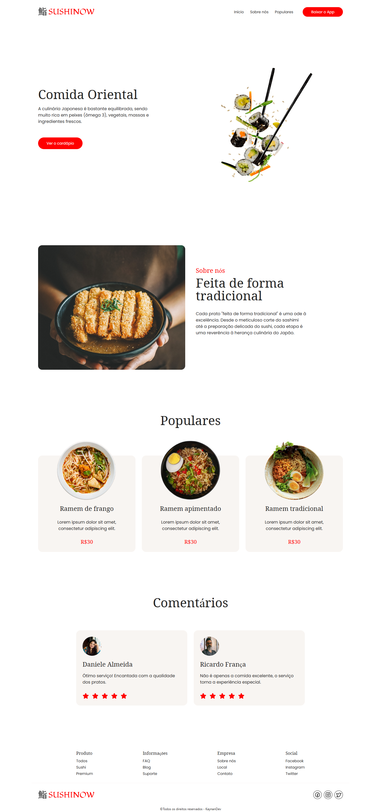

# 🍣 Sushi Now - Landing Page

Landing page fictícia de um restaurante de comida japonesa, criada como parte dos meus estudos em desenvolvimento frontend.

## 🔗 Acesse o Projeto

🌐 [sushi-noww.vercel.app](https://sushi-noww.vercel.app)

## 📸 Preview



---

## 🛠️ Tecnologias Utilizadas

- **Vue.js** – Framework JavaScript progressivo
- **HTML5 & CSS3** – Estrutura e estilos modernos
- **JavaScript** – Lógica da interface
- **Vercel** – Hospedagem e CI/CD automatizado

---

## ⚙️ Como Rodar o Projeto Localmente

```bash
# 1. Clone o repositório
git clone https://github.com/kaynanteixeira/sushi-now.git

# 2. Acesse o diretório do projeto
cd sushi-now

# 3. Instale as dependências
npm install

# 4. Rode o servidor de desenvolvimento
npm run dev
```
